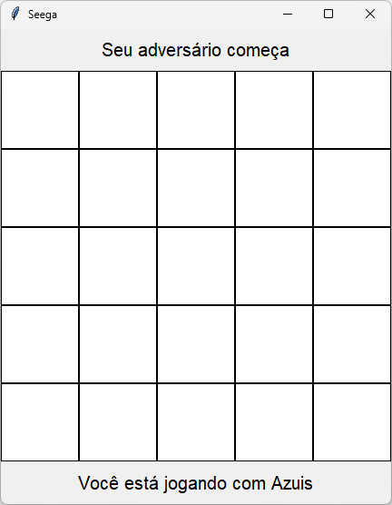
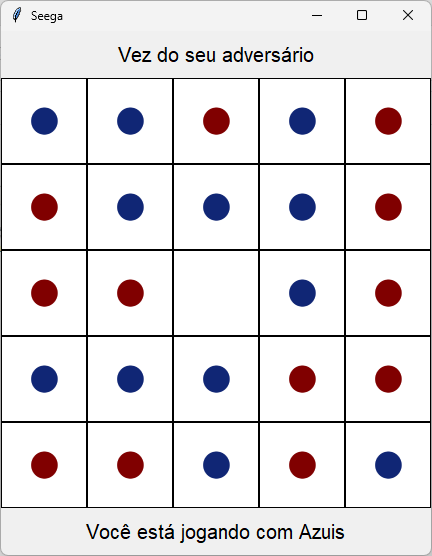

Quer ver esta página em portgues? [Clique Aqui](https://github.com/brenoriios/seega-on-lan/blob/main/README.md)

> Note: This translation was done automatically by Google Translator, an official translation will be released when the portuguese readme is finished

# **What is Seega?**

Seega is a board game for two players.

In this game, each player takes control of pieces of one color and aims to capture all of his opponent's pieces.

An opponent's piece can be captured by surrounding it with yours and the game ends when only one opponent's piece remains on the board.

# **What is the purpose of this project?**

Implement Seega in a way that makes it possible for two people to play against each other within a local network

# **How was the project developed?**

The project was developed using the `Python` language and the following libraries:
- `socket` &rarr; Used to make the connection between clients and server, as well as data transfer between them
- `threading` &rarr; Used to work with multiple threads and handle incoming messages without interrupting the program flow

# **What is the connection protocol?**

The `TCP` protocol was used in the project implementation since, as it is a board game, some possible milliseconds of delay (in relation to the `UDP` connection) are not relevant. In this scenario, it was decided to use a protocol that values the transfer of data reliably and without loss, that is, `TCP`.

# **How is the project structure organized?**

```
├── app
│   ├── src
│   │   ├── images
│   │   │   ├── blue_piece.png
│   │   │   ├── red_piece.png
│   │   │   └── empty_cell.png
│   │   ├── models
│   │   │   ├── Player.py
│   │   │   └── Seega.py
│   │   ├── settings
│   │   │   └── settings.py
│   │   ├── views
│   │   │   └── Board.py
│   │   └──
│   └──
├── client.py
└── server.py
```
Being:
- app &rarr; is the root directory of the project
     - src &rarr; is the project resources directory
         - images &rarr; contains all image assets such as piece icons
         - models &rarr; contains classes with data, for example game states in `Seega.py` or player states in `Player.py`
         - settings &rarr; contains all the constants and definitions used in the project, such as the size of the board, the number of players, etc.
         - views &rarr; contains the classes that have some interface rendering
     - `client.py` &rarr; script used for a player to connect to the server and interact with the game board
     - `server.py` &rarr; script used to keep the server active, start a game, maintain and control the states of a game, control moves, captured pieces, etc.

# **Server execution flow**

Right after starting the server execution:

1. The server instantiates a socket
1. The server assigns an address and port to the socket
1. The server waits for connections
1. The server receives a connection
1. The server accepts the connection
1. The server adds the client to the player list
1. The server assigns the new player a set of pieces
1. The server sends a welcome message to the new player
     > Command: [show_greetings_message](#show_greetings_message)
1. The server repeats steps 3-8 as long as there are less than 2 players
1. The server starts a game: Assigns players to a game instance and sets the first player
1. The server starts a new thread and start "listening" to messages sent by player 1
     > See: list of [commands received by the server](#commands-the-server-receives)
1. The server starts a new thread and start "listening" to messages sent by player 2
     > See: list of [commands received by the server](#commands-the-server-receives)
1. The server sends the command to start the game to the current player
     > Command: [start_game](#start_game)
1. The server sends the command to start the game to the next player
     > Command: [start_game](#start_game)

# **Client execution flow**

Right after starting the client execution:

1. The client instantiates a socket
1. The client instantiates and shows the [connection screen](#connection-screen)
1. The client waits for the user to click connect
1. The client connects to server
1. The client starts a new thread and start "listening" to the messages sent by the server
     > See: List of [commands received by the client](#commands-the-client-receives)
1. The client waits for a click on the interface to send the move command to the server
     > Command: [make_play](#make_play)

# **List of Commands**

## **Commands that the server receives:**

## make_play

Command to make a move, receives a row and a column

> During a play in the [Playing Stage](#playing_stage) this command is received **twice**:
>
> The first time defines **from where** the player's piece will move and then the server sends the [command to highlight possible moves](#highlight_cell_move_options)
>
> The second time defines **where** the player's piece will move and then the server sends the [command to update the board](#re_draw) if it's a valid move

``` JSON
{
     "type": "command",
     "head": "make_play",
     "body": [ row, column ]
}
```

## **Commands that the client receives:**

## show_greetings_message

Command that updates the interface with the welcome message

``` JSON
{
    "type": "command",
    "head": "show_greetings_message",
    "body": "Bem Vindo(a)!\n Você está jogando com {player_piece}"
}
```

> player_piece &rarr; Player piece color

## start_game

Command to start the game, sends as data if it is the player's turn or not and the information of the board that at that first moment is empty.

``` JSON
{
     "type": "command",
     "head": "start_game",
     "body": [
         current_player_message,
         board_info
     ]
}
```
> board_info &rarr; Matrix representing the board

For the current player: `current_player_message = "Sua Vez"`

For the next player: `current_player_message = "Vez do Adversário"`

## highlight_cell_move_options

Command that updates the board with possible moves for a piece selected by the current player

``` JSON
{
     "type": "command",
     "head": "highlight_cell_move_options",
     "body": [
         move_options
     ]
}
```

> move_options &rarr; List of valid positions (row, column) for a position (row, column)

## re_draw

Command that updates the board and the player's turn in the interface

``` JSON
{
     "type": "command",
     "head": "re_draw",
     "body": [
         current_player_message,
         board_info
     ]
}
```

> board_info &rarr; Matrix representing the board

For the current player: `current_player_message = "Sua Vez"`

For the next player: `current_player_message = "Vez do Adversário"`

## end_game

Command that displays the winner in the interface and ends the game

For the current player:

``` JSON
{
     "type": "command",
     "head": "end_game",
     "body": "Você Venceu!"
}
```

For the next player:

``` JSON
{
     "type": "command",
     "head": "end_game",
     "body": "O Adversário Venceu..."
}
```

# **Screens**

## Connection Screen


## Greetings Screen


## Game Screen (Placement Phase)

### First to Play


### Second to Play


## Game Screen (Game Phase)

### Current Player


### Next Player
