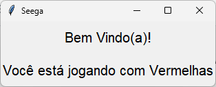

Want to see this page in english? [Click Here](https://github.com/brenoriios/seega-on-lan/blob/main/README-EN.md)

# **O que é Seega?**

Seega é um jogo de tabuleiro para dois jogadores.

Nesse jogo cada jogador assume o controle das peças de uma cor e tem como objetivo capturar todas as peças do seu adversário.

Uma peça do adversário pode ser capturada cercando-a com as suas e o jogo acaba quando restar apenas uma peça do adversário no tabuleiro.

# **Qual o objetivo desse projeto?**

Implementar o Seega de uma forma que seja possível duas pessoas jogarem uma contra a outra dentro de uma rede local

# **Como o projeto foi desenvolvido?**

O projeto foi desenvolvido utilizando a linguagem `Python` e suas bibliotecas:
- `socket` &rarr; Utilizada para fazer a conexão entre clientes e servidores, bem como transferência de dados entre eles
- `threading` &rarr; Utilizada para trabalhar com mútipos threads e lidar com as mensagens recebidas sem interromper o fluxo do programa

# **Qual o protocolo de conexão?**

Foi utilizado na implementação do projeto o protocolo `TCP` já que, por se tratar de um jogo de tabuleiro, alguns possíveis milisegundos de atraso (em relação à conexão `UDP`) não são relevantes. Nesse cenário optou-se pela utilização de um protocolo que preza pela transferência de dados de maneira confiável e sem perda, ou seja, o `TCP`.

# **Como está organizada a estrutura do projeto?**

```
├── app
│   ├── src
│   │   ├── images
│   │   │   ├── blue_piece.png
│   │   │   ├── red_piece.png
│   │   │   └── empty_cell.png
│   │   ├── models
│   │   │   ├── Player.py
│   │   │   └── Seega.py
│   │   ├── settings
│   │   │   └── settings.py
│   │   ├── views
│   │   │   └── Board.py
│   │   └──
│   └──
├── client.py
└── server.py
```
Sendo:
- app &rarr;  é o diretório raiz do projeto
    - src &rarr;  é o diretório dos recursos do projeto
        - images &rarr; contém os todos recursos de imagem, como os ícones das peças
        - models &rarr; contém as classes com os dados, por exemplo estados de jogo em `Seega.py` ou do jogador em `Player.py`
        - settings &rarr; contém todas as constantes e definições utilizadas no projeto, como o tamanho do tabuleiro, o número de jogadores etc
        - views &rarr; contém as classes que possuem alguma renderização de interface
    - `client.py` &rarr; script utilizado para que um jogador conecte-se ao servidor e interaja com o tabuleiro do jogo
    - `server.py` &rarr; script utilizado para manter o servidor ativo, iniciar um jogo, manter e controlar os estados de um jogo, controlar as jogadas, as peças capturadas etc

# **Fluxo de excução do servidor**

Logo após iniciar a execução do servidor:

1. O servidor instancia um socket
1. O servidor atribui um endereço e porta ao socket
1. O servidor espera por conexões
1. O servidor recebe uma conexão
1. O servidor aceita a conexão
1. O servidor adiciona o cliente na lista de jogadores
1. O servidor atribui ao novo jogador um conjunto de peças
1. O servidor envia um comando com a mensagem de boas vindas ao novo jogador
    > Comando: [show_greetings_message](#show_greetings_message)
1. O servidor repete os passos 3-8 enquanto existirem menos do que 2 jogadores
1. O servidor inicializa um jogo: Atribui os jogadores a uma instancia do jogo e define o primeiro jogador
1. O servidor inicia um novo thread e fica "ouvindo" as mensagens enviadas pelo jogador 1
    > Veja: lista de [comandos recebidos pelo servidor](#comandos-que-o-servidor-recebe)
1. O servidor inicia um novo thread e fica "ouvindo" as mensagens enviadas pelo jogador 2
    > Veja: lista de [comandos recebidos pelo servidor](#comandos-que-o-servidor-recebe)
1. O servidor envia o comando para iniciar o jogo para o jogador atual
    > Comando: [start_game](#start_game)
1. O servidor envia o comando para iniciar o jogo para o próximo jogador
    > Comando: [start_game](#start_game)

# **Fluxo de excução do cliente**

Logo após iniciar a execução do cliente:

1. O cliente instancia um socket
1. O cliente instancia e mostra a [tela de conexão](#tela-de-conexão)
1. O cliente aguarda o usuário clicar em conectar
1. O cliente se conecta ao servidor
1. O cliente inicia um novo thread e fica "ouvindo" as mensagens enviadas pelo servidor
    > Veja: lista de [comandos recebidos pelo cliente](#comandos-que-o-cliente-recebe)
1. O cliente espera um clique na interface para enviar o comando de fazer jogada para o servidor
    > Comando: [make_play](#make_play)

# **Lista de Comandos**

## **Comandos que o servidor recebe:**

## make_play

Comando para fazer uma jogada, recebe uma linha e uma coluna

> Durante uma jogada na [fase de jogadas](#playing_stage) esse comando é recebido **duas vezes**:
>
> Na primeira vez define **de onde** a peça do jogador vai se mover e então o servidor envia o [comando para destacar as jogadas possíveis](#highlight_cell_move_options)
>
> Na segunda vez define **para onde** a peça do jogador vai se mover e então o servidor envia o [comando para atualizar o tabuleiro](#re_draw) se for um movimento válido

``` JSON
{
    "type": "command",
    "head": "make_play",
    "body": [ row, column ]
}
```

## **Comandos que o cliente recebe:**

## show_greetings_message

Comando que atualiza a interface com a mensagem de boas vindas

``` JSON
{
    "type": "command",
    "head": "show_greetings_message",
    "body": "Bem Vindo(a)!\n Você está jogando com {player_piece}"
}
```

> player_piece &rarr; Cor da peça do jogador

## start_game

Comando para iniciar o jogo, envia como dados se é a vez do jogador ou não e as informações do tabuleiro que nesse primeiro momento está vazio.

``` JSON
{
    "type": "command",
    "head": "start_game",
    "body": [
        current_player_message,
        board_info
    ]
}
```
> board_info &rarr; Matriz que representa o tabuleiro

Para o próximo jogador: `current_player_message = "Sua Vez"`

Para o jogador atual: `current_player_message = "Vez do Adversário"`

## highlight_cell_move_options

Comando que atualiza o tabuleiro com as jogadas possíveis para uma peça selecionada pelo jogador da vez

``` JSON
{
    "type": "command",
    "head": "highlight_cell_move_options",
    "body": [
        move_options
    ]
}
```

> move_options &rarr; Lista de posições (linha, coluna) válidas para uma determinada posição (linha, coluna)

## re_draw

Comando que atualiza o tabuleiro e a vez do jogador na interface

Para o jogador atual:

``` JSON
{
    "type": "command",
    "head": "re_draw",
    "body": [
        current_player_message,
        board_info
    ]
}
```
> board_info &rarr; Matriz que representa o tabuleiro

Para o próximo jogador: `current_player_message = "Sua Vez"`

Para o jogador atual: `current_player_message = "Vez do Adversário"`

## end_game

Comando que exibe o vencedor na interface e encerra o jogo

Para o jogador atual:

``` JSON
{
    "type": "command",
    "head": "end_game",
    "body": "Você Venceu!"
}
```

Para o próximo jogador:

``` JSON
{
    "type": "command",
    "head": "end_game",
    "body": "O Adversário Venceu..."
}
```

# **Telas**

## Tela de Conexão


## Tela de Boas Vindas


## Tela de Jogo (Fase de Posicionamento)

### Primeiro a Jogar


### Segundo a Jogar


## Tela de Jogo (Fase de Jogo)

### Jogador da Vez


### Próximo Jogador
